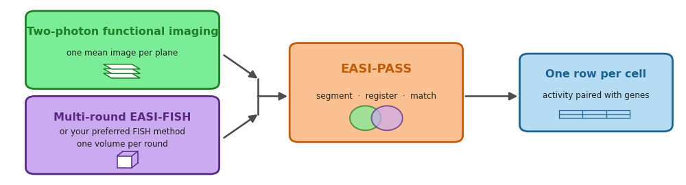
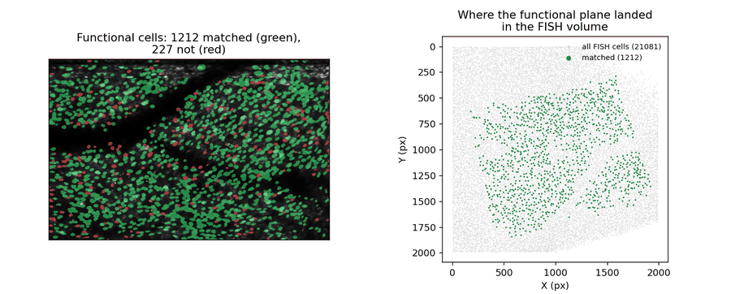
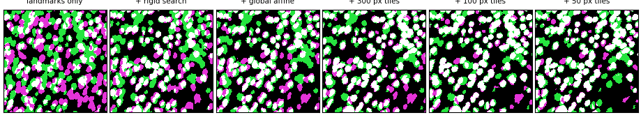

# EASI-PASS

Match cells between two-photon functional imaging and multi-round HCR FISH, and get one table
joining functional identity to molecular readout. Also runs on FISH rounds alone, with no
functional data.



## Inputs

| | Format |
|---|---|
| Functional field of view | One 2D mean image per plane, TIFF |
| FISH rounds | One multi-channel 3D volume per round, TIFF. EASI-FISH or another HCR FISH protocol |
| Hi-res structural image *(optional)* | One stitched 2D TIFF per plane |
| Landmarks | A few points placed once in [BigWarp](https://imagej.net/plugins/bigwarp). Not needed for FISH-only runs |

Everything else is set in a [manifest](docs/manifest.md). The run pauses four times: to set the
orientation, place landmarks, check the segmentation, and accept the alignment.

## Installation

Python 3.12. A few minutes. Both routes give the identical environment.

**[uv](https://docs.astral.sh/uv/)**, recommended: far faster, and it downloads its own Python,
so nothing has to be set up first.

```bash
git clone https://github.com/orena1/easi-pass.git
cd easi-pass
uv venv --python 3.12 && source .venv/bin/activate
uv pip install -e . -c requirements.txt
```

**conda:**

```bash
git clone https://github.com/orena1/easi-pass.git
cd easi-pass
conda env create -f environment.yml && conda activate easipass
pip install -e . -c requirements.txt
```

Activate again in every new shell: `source .venv/bin/activate` (`.venv\Scripts\activate` on
Windows), or `conda activate easipass`. No GPU required. Cross-modal runs also need
[Fiji](https://fiji.sc/) for landmarks.

Installing uv, plain venv, the GPU check, troubleshooting: [docs/install.md](docs/install.md).

## Demo

One two-photon plane from mouse JS078 aligned to a 5-channel HCR FISH volume, with a reference
result to check against. Nothing to edit.

```bash
python demo/fetch_demo_data.py                            # 191 MB, needs ~1.3 GB free
python master_pipeline.py --manifest demo/JS078_demo.hjson
```

Prompts to answer and numbers to expect: [demo/README.md](demo/README.md).

Notebook to explore demo results: [`demo/explore_results.ipynb`](demo/explore_results.ipynb).
Works on any finished `OUTPUT` folder.

```bash
jupyter lab demo/explore_results.ipynb
python demo/explore_results.py --output PATH/OUTPUT   # same plots, no Jupyter
```



## Running your own data

**1. Copy a template.** [`demo_tiff.hjson`](examples/demo_tiff.hjson) for functional + FISH,
[`demo_hcr_only.hjson`](examples/demo_hcr_only.hjson) for FISH alone. Either runs as it stands
once the paths are yours.

**2. Lay out your files.** `base_path` is the folder that *contains* your samples, so several
manifests can share one and differ only by `sample_name`.

```
/data/experiments/M12/          base_path: "/data/experiments", sample_name: "M12"
├── 2P/
│   ├── plane_0.tiff            functional mean image, one per plane
│   └── plane_0_hires.tiff      optional, must already be stitched
├── HCR/
│   ├── HCR01.tiff              reference round
│   └── HCR02.tiff              further rounds
└── OUTPUT/                     created by the pipeline
```

`{N}` in `plane_{N}.tiff` matches an entry in `functional_planes`; `{R}` in `HCR{R}.tiff`
matches a `round` value.

**3. Settle the alignment first.** It is the step most likely to need another attempt.

```bash
python master_pipeline.py --manifest your_manifest.hjson --check_alignment
```

Stops after matching the functional planes to the reference round. Review
`OUTPUT/2P/registered/QualityCheck/`, then re-run without the flag. Everything the check
produced is reused.

## How it works

**Before segmentation**

| Step | |
|---|---|
| **1. Orient the functional image** | The pipeline prints both paths and waits. If one is mirrored, add `fliplr` or `flipud` to `rotation_2p_to_HCR`. Only mirroring has to be right here; the landmarks in step 2 handle rotation |
| **2. Place landmarks** | A handful of points in BigWarp. Runs before Cellpose on purpose, so a bad alignment costs minutes instead of an hour of segmentation |

**Segmentation**

| Step | |
|---|---|
| **3. Functional** | Cellpose on each mean image |
| **4. Molecular** | Cellpose per FISH plane, linked across planes into 3D cells |

**Molecular side**, once, covering all rounds

| Step | |
|---|---|
| **5. Round-to-round registration** | Cell centroids initialize a global affine (RANSAC), then block-wise deformable refinement (BigStream). Tries several search radii, writes a QC image for each, waits for you to pick |
| **6. Probe intensity extraction** | Per-cell fluorescence per channel, with local background |

**Cross-modal**, per plane

| Step | |
|---|---|
| **7. Low-res to hi-res placement** | Only when a hi-res structural image is supplied |
| **8. Registration** | Landmarks define a thin-plate spline surface, then a rigid search, a global affine, and a coarse-to-fine tile cascade |
| **9. Matching** | Mask overlap (IoU) and soma-print, both reported per cell |

Step 8 tightens the fit in stages and writes a QC image after each, so you can see where it
stopped improving:



**Output**

| Step | |
|---|---|
| **10. Merged table** | One row per cell: matched identities, per-gene intensities, match-quality scores |

FISH-only runs skip steps 1, 2, 3, 7 and 8, and at step 9 match rounds to each other.

## Outputs

Everything lands under `{base_path}/{sample_name}/OUTPUT/`:

```
OUTPUT/
├── HCR/
│   ├── cellpose/                 3D FISH masks
│   ├── cellpose_aligned/         those masks warped into the reference frame
│   └── extract_intensities/      per-cell fluorescence per channel
├── 2P/
│   ├── cellpose/                 2D functional masks
│   └── registered/               landmarks, transforms, QC overlays
└── MERGED/
    ├── aligned_masks/            per-cell match tables
    └── aligned_extracted_features/   final tables, matches joined to genes
```

The result is in `MERGED/aligned_extracted_features/`. Whether alignment worked is in
`2P/registered/QualityCheck/`.

Every column of both tables: [docs/outputs.md](docs/outputs.md).

## Documentation

| | |
|---|---|
| [Install](docs/install.md) | uv and venv, the GPU check, troubleshooting |
| [Manifest](docs/manifest.md) | Every field, and the parameters worth changing |
| [Landmarks](docs/landmarks.md) | What the pipeline needs from you, and the file format |
| [BigWarp tips](docs/BigWarp_Tips.md) | How to drive BigWarp |
| [Outputs](docs/outputs.md) | Every column of every table |
| [Bring your own masks](docs/masks.md) | Skip Cellpose on either side |
| [Re-running](docs/rerunning.md) | What is skipped, what is asked, what is rebuilt |

## Source layout

| File | Purpose |
|---|---|
| `master_pipeline.py` | The command line, and the order every step runs in |
| `easipass/meta.py` | Manifest parsing and validation |
| `easipass/importers.py` | Picks the reader for your `input_format` |
| `easipass/functional.py` | Reads the functional side, applies the flip and rotation |
| `easipass/segmentation.py` | Cellpose segmentation, mask matching, merged tables |
| `easipass/registrations.py` | Runs the registration steps in order |
| `easipass/registrations_utils.py` | Cross-modal registration algorithms |
| `easipass/hcr_centroid_registration.py` | Centroid-seeded round-to-round registration |
| `easipass/somaprint.py`, `somaprint_hcr.py` | Soma-print matchers, cross-modal and round-to-round |

The rest of `easipass/` is supporting code: tile stitching, automation checkpoints, BigStream
wrappers, and analysis helpers.

## Citation

If you use EASI-PASS, please cite the accompanying paper. Details will be added here on
publication; see [CITATION.cff](CITATION.cff).

## License

BSD 3-Clause. See [LICENSE](LICENSE).
